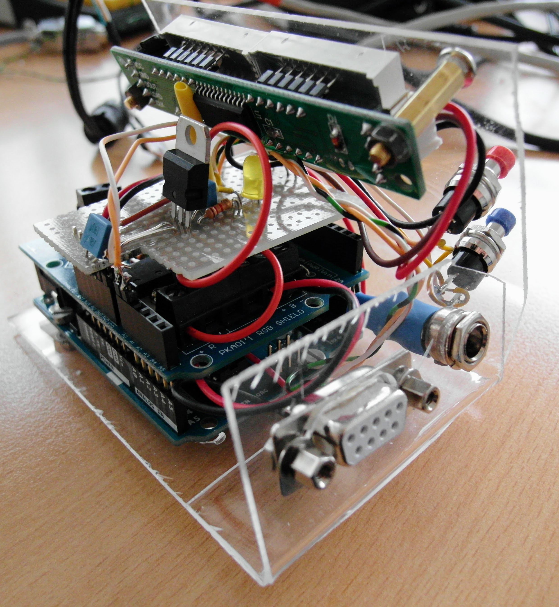
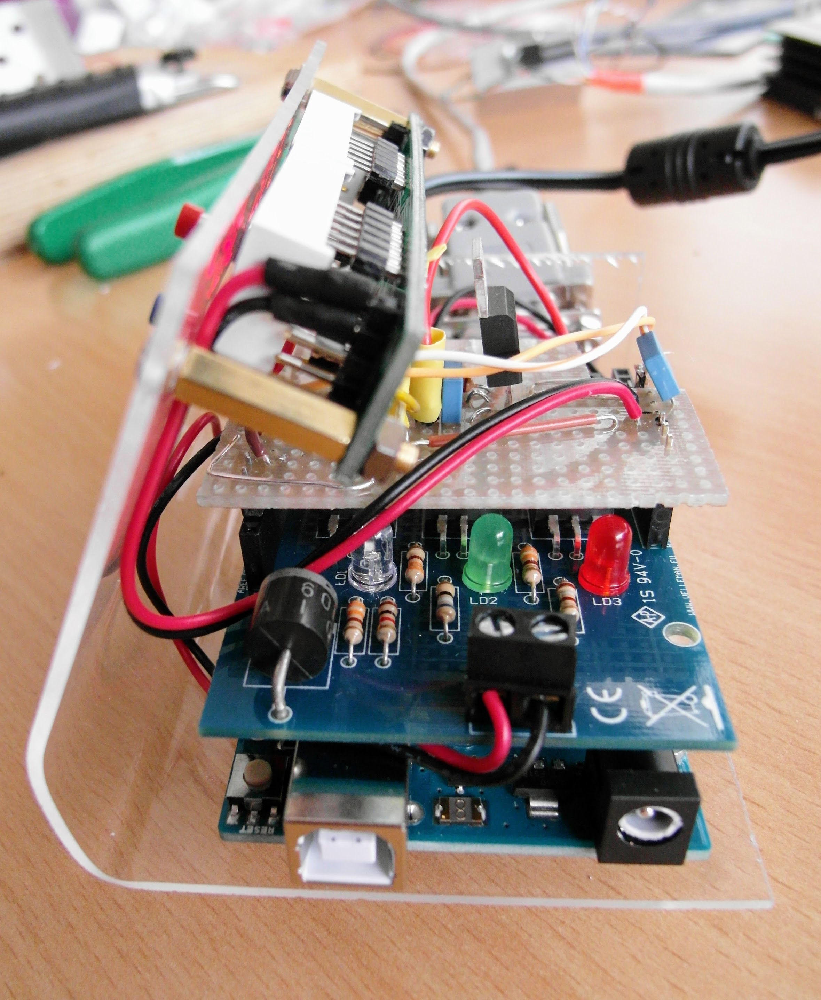
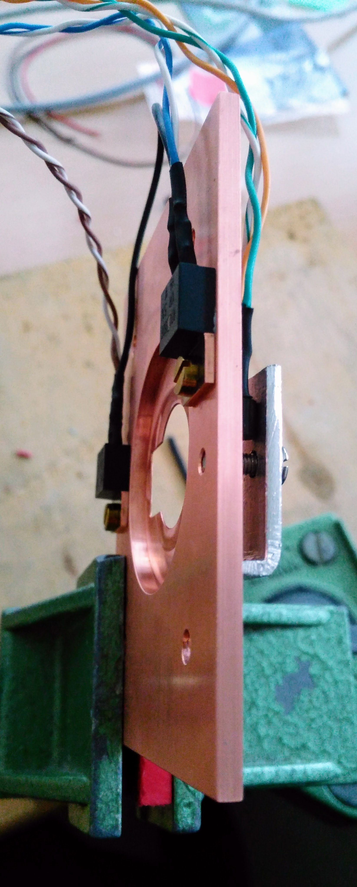
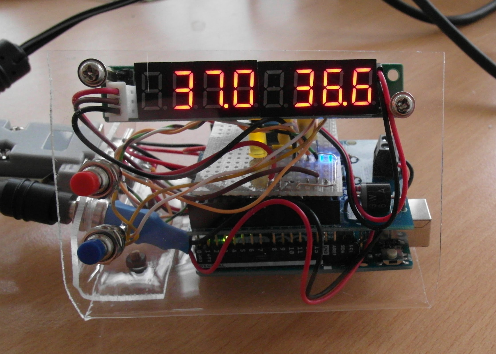
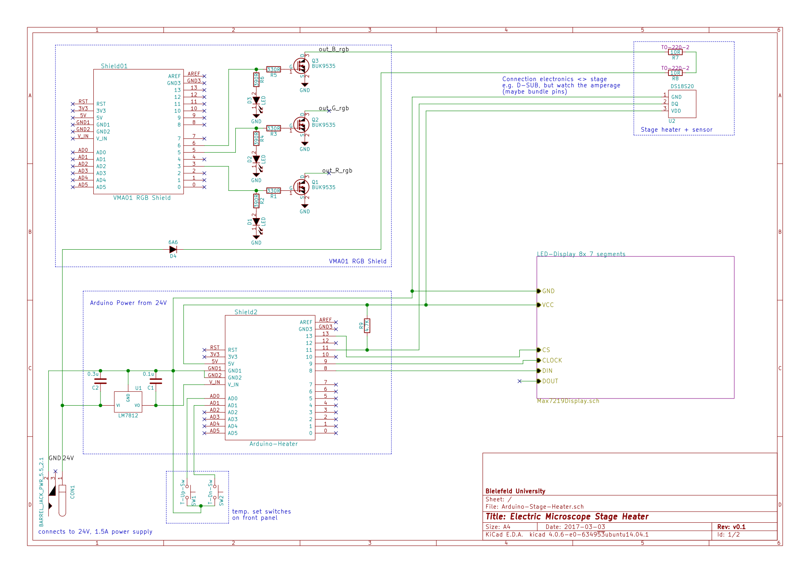

# What`s it for?

In fluorescence microscopy, samples (biological cells) are typically either
kept at room temperature or heated to approx. 37°C. 

For a prototype microscope, we needed a quick and vibration-free 
way to heat the stage (a copper plate holding the sample) to these 37°C.

The whole project took a day to build, and even longer to document here :).
It uses standard, off-the-shelf components around an Arduino Uno.

Raw files for code and schematics can be found [here on github](https://github.com/mueller-physics/arduino-stage-heater).
Also, [me](http://www.mueller-physics.org) and the [Biomolecular Photonics group](http://www.physik.uni-bielefeld.de/biopho) at
Bielefeld University.

# Photos

Looks like it was put together in a days work, doesn`t it?

# Materials

* Sample holder, in our case a copper plate
* 2x 10 Ohm resistors, TO-220 case (e.g. 
[digikey](http://www.digikey.com/product-detail/en/riedon/PF2205-10RF1/696-1331-ND/3934407), 
[reichelt](https://www.reichelt.de/Dickschichtwiderstaende-TO220/RTO-20F-10/3/index.html?ACTION=3&GROUPID=4336&ARTICLE=89470))
* DS18S20 or DS18B20 digital temperature sensor (
[DS18S20](https://datasheets.maximintegrated.com/en/ds/DS18S20.pdf), 
[DS18B20](https://datasheets.maximintegrated.com/en/ds/DS18B20.pdf), 
[reichelt](https://www.reichelt.de/ICs-CA-HV-/DS-18B20/3/index.html?ACTION=3&LA=446&ARTICLE=58169&GROUPID=7209&artnr=DS+18B20))

* Arduino Uno (or compatible)
* Arduino RGB shield (by 
[Velleman](https://www.velleman.eu/products/view/?id=412534), 
e.g. [reichelt](https://www.reichelt.de/Erweiterungsboards/ARDUINO-SHDB-RGB/3/index.html?ACTION=3&LA=446&ARTICLE=153053&GROUPID=6669&artnr=ARDUINO+SHDB+RGB))

* Maxim-7219-based 8x 7-segment LED display (see e.g. 
[here](http://embedded-lab.com/blog/spi7segdisp8-56-kit-is-now-available-with-blue-seven-segment-led-displays/), 
[amazon](https://www.amazon.de/AptoFun-MAX7219-8-stellige-digital-Display-Modul-Brett/dp/B01IROOFF6))
* 2x push button switches

* 24V power supply, 1.5A or more
* Connectors, e.g. D-SUB 9 and barrel connector matching power supply
* 7812 linear voltage regulator, with capacitors
* An LED, resistors 1k, 4.7k, cable to connect stage and controller

* Some form of case, we just used a sheet of acrylic glass

Depending on where you order, the bill of material (excluding the sample holder) should
run around 75€ (last checked 2017-03-06).

# Schematics

These were drawn to learn a bit how to operate [KiCad EDA](http://www.kicad-pcb.org),
the raw files are [here](https://github.com/mueller-physics/arduino-stage-heater/tree/master/circuits/).

# Building and using it

* The TO-220 resistors and the temperature sensor are fixed to the stage (use heat-conductive paste for thermal coupling). Put some distance between the sensor and the resistors.
* The resistors are wired in series, so they yield 20 Ohm. The sensor is wired separately (as they share neither ground nor VCC).
* The RGB shield is set to "external power", and powered by the 24V supply. The resistors are connected to the blue channel.

* The 7812 regulator down-converts 24V to 12V, as the Arduino should not be powered from 24V directly. 
It sits on a small hand-wired circuit board on top, with a control LED on the 12V side.
It feeds into the 'VCC' pin of the Arduino (do not use the +5V pin!)

* The push buttons are connected to A0 and A1, and short to ground when closed. The internal pull-up resistors are used on these pins.
* The display connects to pin 8 (data), pin 9 (clock), pin 13 (device select). 
It is powered off the +5V supply by the Arduino (do not use +12V or +24V!).
It uses the [LedCotrol](http://playground.arduino.cc/Main/LedControl) library, as it is based on an MAX7219.
* The DS18?20 is connected to pin 11, pulled to +5V by a 4.7k resistor. It also connects to +5V and ground.
It uses the [OneWire](http://playground.arduino.cc/Learning/OneWire) library.

* We just used a heat-bended sheet of acrylic glass to fix all components. Of course any case should do.

With the current code:

* The push buttons adjust target temperature (+/- 0.1 °C)
* The right numbers show the current temperature (as measured by the DS18?20)
* The left numbers alternate between target temperature and heating power (in percent, postfixed by 'H').
* Each measurement is also printed to the serial port
* The code is work-in-progress, it will get a more proper feedback mechanism in the next days.

# Remarks and possible improvements

* Component choices are out of convenience, parts can easily be substituted
* The RGB shield is just 3 logic-level MOSFETs, and only one is used.
* Any Arduino-compatible display (LED, LCD, OLED) should do, the MAX7219-based just was at hand.
* Adding a heat sink to the 7812 is a good idea (or replacing it with something more modern
than a linear regulator). Otherwise, limit the 12V and 5V rails to maybe max. 90mA in total.
* More DS18?20 can be daisy-chained to provide multiple measurements
* Running 28W (20Ohm at 24V) gives plenty of heat for a 6cm x 6cm stage. Sustaining 37°C runs at
about 20% power
* Adding a cover will greatly improve and even out the temperature in the sample (though the stage itself already
helps a lot).
* With bigger power supply, 3x 2A current at 24V are available. Thats up to 144W, so plenty of power!

# Comments

If you find the project useful, or have add-ons or suggestions, just send an e-mail, twitter me, or
use any of the github issue / pull request tools.
